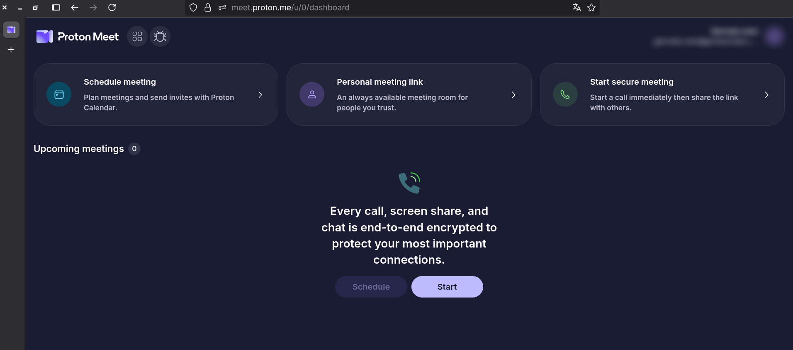
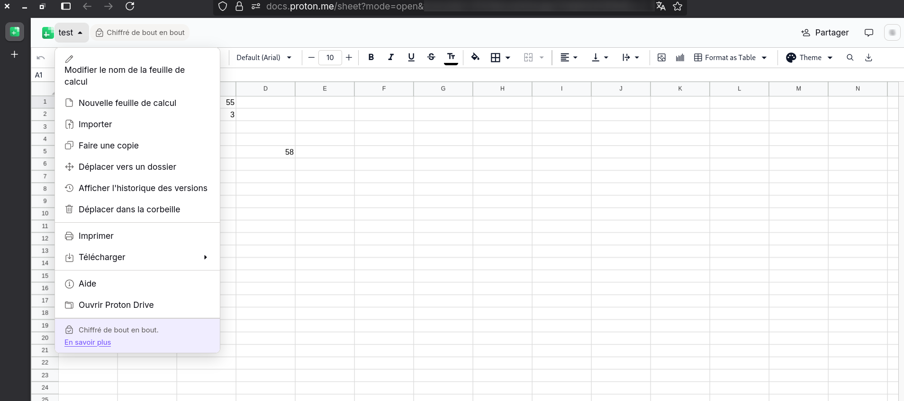

<h1>Proton Preview</h1>
 

______________________________________________________________________

This script enable proton-sheet and proton-meet preview

### Instalation
- Add [tampermonkey](https://www.tampermonkey.net/index.php) in your web browser
- Add the client.js script in tampermonkey
- Go to [https://meet.proton.me](https://meet.proton.me) or [https://docs.proton.me/sheet](https://docs.proton.me/sheet)

## Important
if you are not a developer or a technical administrator, never trust a script you don’t understand. The JavaScript runs client‑side; it may contain network calls, manipulate the DOM, or interact with your Proton accounts. Without carefully reviewing the code, you cannot guarantee that there is no risk of data leakage, unexpected behavior, or violations of your security policies.

to Proton developers / administrators: I do not have an in‑depth understanding of the exact legality of this small script with respect to your internal policies or applicable legislation. If, after review, you determine that this project violates your rules or the law, I commit to immediately delete the repository and remove all related code.
